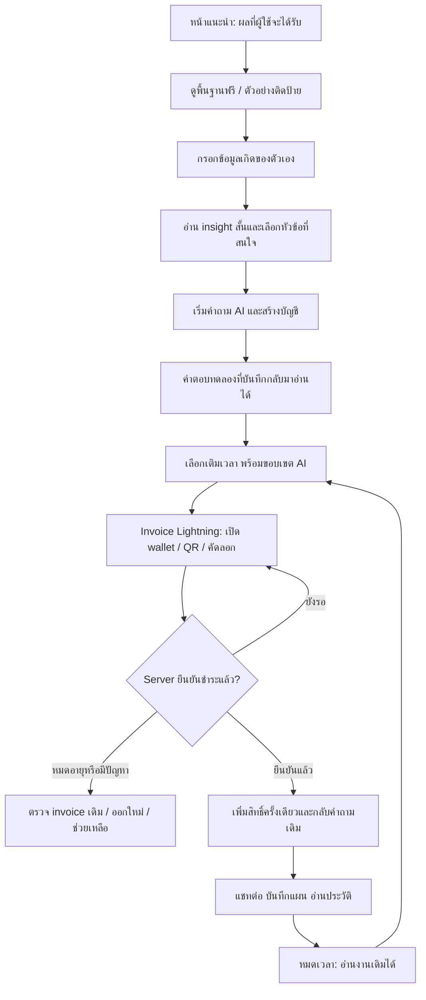

# Solarian: ตรวจบริการผู้ใช้, UX/UI, การตลาด และระบบเติมเวลาผ่าน Lightning

วันที่ตรวจ: 13 กันยายน 2026 · ขอบเขต: โค้ดใน workspace ปัจจุบัน ไม่ใช่การรับรองระบบ production

รายงานนี้รวมผลจากซับเอเจนต์ผู้ตรวจ UX/UI และผู้เชี่ยวชาญการตลาด กับการตรวจ backend, ต้นทุน, เอกสาร deployment และหน้าเว็บจริงโดยเอเจนต์หลัก ใช้ทักษะ ui-ux-pro-max และ Browser ไม่ได้เปลี่ยนโค้ดแอป เปิดรับเงินจริง หรือเรียก AI แบบเสียเงิน

## ข้อสรุปสำหรับการตัดสินใจ

Solarian มีฐานผลิตภัณฑ์ที่เหมาะกับการให้ผู้ใช้ลองก่อนจ่าย: ดวงพื้นฐานที่คำนวณโดยไม่ต้องเรียก AI, โหมดอ่านง่ายและโหมดมืออาชีพ, แผนที่ชีวิต, ปาจื่อ, PDF และหลายโปรไฟล์ แต่ยังมีช่องว่างของบริการที่ทำให้ผู้ใช้เสียงานหรือเข้าใจผลผิด และระบบเก็บเงินยังเป็น simulation

ลำดับที่ควรทำคือ **ปิดช่องสิทธิ์ฟรี/สิทธิ์แอดมิน → ทำให้รายงานและแชทเชื่อถือได้ → เติมเวลา Lightning พร้อมเพดานต้นทุน → ปรับ onboarding และทดลอง acquisition** การเพิ่มโฆษณาก่อนแก้ปัญหาเหล่านี้จะพาผู้ใช้เข้าสู่ประสบการณ์ที่ยังรักษาลูกค้าไม่ได้

โมเดลที่เสนอคือ **จ่ายครั้งเดียวเพื่อเพิ่มช่วงเวลาเข้าถึง พร้อมโควตา AI ที่แจ้งก่อนจ่าย ไม่มี subscription และไม่มีต่ออายุอัตโนมัติ** เวลาปฏิทินเพียงอย่างเดียวไม่จำกัดต้นทุน AI จึงไม่ควรขาย unlimited การคุมต้นทุนช่วยจำกัดความเสี่ยงภายใต้เงื่อนไขที่กำหนด แต่ไม่สามารถรับประกันธุรกิจไม่ขาดทุนทุกสถานการณ์

## 1. สิ่งที่ตรวจและข้อจำกัด

- อ่าน React/Vite/TypeScript frontend, FastAPI/SQLAlchemy backend, authentication, models, AI integration, tests, Docker และเอกสาร
- ตรวจหน้าแรกและหน้า AI ในเบราว์เซอร์ที่ localhost:8000 ยืนยัน auto-preset และข้อความบริการที่แสดงจริง; ตรวจ viewport กว้าง 390px พบ document scroll width 384px ไม่พบ horizontal overflow ระดับเอกสารในสถานะที่ตรวจ
- การคลิก auth บนมือถือหยุดที่ browser timeout จึงไม่อ้างว่าทดสอบ mobile auth, keyboard, screen reader หรือ wallet round-trip ครบแล้ว; browser ใช้ build ที่ server ปัจจุบันให้บริการ ไม่ได้ rebuild เพื่อรับรองว่า artifact ตรงกับ source ทุกส่วน
- รัน backend tests กับฐานข้อมูลชั่วคราวและปิด Gemini key: **16 ผ่าน** ไม่แตะข้อมูลบัญชีในฐานข้อมูลจริง
- TypeScript check ผ่าน; lint จบสำเร็จพร้อม **9 warnings**
- ทดลอง API เพิ่มในฐานข้อมูลชั่วคราว: ผู้สมัครคนแรกได้ role admin; ผู้ใช้คนที่สองอัปเกรดเป็น pro ได้โดยไม่ชำระเงิน
- ไม่มี payment provider, invoice จริง, usage ledger, ค่าโฆษณา หรือข้อมูล cohort ให้ตรวจ ราคาที่เสนอด้านล่างเป็นแบบจำลอง ไม่ใช่ราคาที่ผ่านตลาดแล้ว

## 2. โครงสร้างผลิตภัณฑ์ปัจจุบัน

| ส่วน | สิ่งที่มี | ผลต่อบริการ |
|---|---|---|
| การคำนวณ | Swiss Ephemeris, มหาทักษา, transits, Bazi | ทำผลฟรีก่อนเรียก AI ได้ แต่ยังมีต้นทุน CPU/hosting |
| หน้าผู้ใช้ | Companion, Pro Studio, Bazi, AI | ครอบคลุมหลายระดับความรู้ แต่ผู้ใช้ใหม่ต้องเลือกหลายโหมดเร็วเกินไป |
| บัญชี | email/password, JWT, หลายโปรไฟล์ | รองรับการกลับมาใช้ แต่ยังขาด recovery และประวัติ AI |
| AI | Gemini 2.5 Flash + deterministic fallback | มีคำตอบเมื่อ provider ล้ม แต่การคิดสิทธิ์และการสื่อสาร fallback ยังไม่ชัด |
| การเก็บเงิน | free/premium/pro, upgrade simulation | ยังไม่ใช่ระบบรับชำระเงินจริง และไม่ใช่ระบบเติมเวลา |
| การบริหาร | จำนวน user, tier และ query | ยังวัดรายได้ settled, ต้นทุน, fulfillment หรือกำไรไม่ได้ |

## 3. ประเด็นที่ต้องแก้ก่อนเปิดขาย

P0 = ปิดก่อนเปิดรับเงินจริง/เปิดสาธารณะ, P1 = กระทบความถูกต้องและการรักษาลูกค้า, P2 = ปรับ funnel และคุณภาพการใช้งาน

| ระดับ | หลักฐานในโค้ด | ความเสี่ยง / งานที่ต้องทำ |
|---|---|---|
| P0 | `backend/main.py:586` | upgrade-simulation เปลี่ยน tier โดยไม่ตรวจ invoice ผู้ใช้ทั่วไปเปิด AI ได้ฟรี ลบออกจาก production และใช้ entitlement จาก settled ledger เท่านั้น |
| P0 | `backend/main.py:247` | บัญชีแรกหรือผู้ใช้ที่กรอกอีเมลแอดมินได้ admin โดยไม่มี email ownership verification ใช้ provisioning แอดมินนอก public registration; ห้ามให้สิทธิ์จากอีเมลที่ผู้สมัครอ้างเอง |
| P0 | `backend/auth.py:21`, `.env.example`, `docker-compose.yml` | auth อ่าน JWT_SECRET แต่ deployment ส่ง JWT_SECRET_KEY ทำให้ใช้ค่าคงที่ fallback ได้ ต้องชื่อเดียวกันและ fail startup เมื่อ secret ไม่พร้อม พร้อม invalidate token ที่ออกด้วย key เก่าเมื่อแก้จริง |
| P0 | `backend/models.py:18`, `:33` | has_ai_access ดู tier ไม่ตรวจ subscription_expires_at ไม่มี ledger หรือเพดานค่าใช้จ่าย เปลี่ยนเป็นเวลาเข้าถึง + โควตา + การกันงบแบบ atomic |
| P0 | `backend/engine/ai_counselor.py:102` | เก็บแค่ text ทิ้ง usage metadata, ไม่มี input token cap และไม่ตั้ง thinking budget ชัดเจน จึงยังคำนวณ/บังคับขอบเขตต้นทุนต่อคำขอไม่ได้ |
| P0 | `backend/database.py:44`, `docker-compose.yml` | key ที่สร้างอัตโนมัติอยู่ backend/.secret_key แต่ volume เก็บ /app/data เมื่อ container ถูกสร้างใหม่ key อาจหายและอ่านโปรไฟล์เดิมไม่ได้ ต้องเก็บ key อย่างถาวรและทดสอบ restore คู่กับ DB |
| P1 | `AICounselorView.tsx:47`, `:52`; `App.tsx:665` | reading/messages อยู่ component state; สลับแท็บแล้ว unmount ทำให้งานหาย ต้องบันทึก server-side และอ่านประวัติเดิมได้โดยไม่เรียก AI ซ้ำ |
| P1 | `AICounselorView.tsx:367`; `App.tsx:215` | รายงานไม่ผูก snapshot ของโปรไฟล์ ชื่อใหม่อาจอยู่เหนือ reading เก่า ต้องแยก thread/profile/version และกัน response เก่าทับคนใหม่ |
| P1 | `AICounselorView.tsx:162`; `backend/main.py:619`, `:755` | มี history field แต่ไม่ได้ใช้ประวัติในการตอบ คำถามต่อไม่ต่อเนื่อง ต้องเก็บ thread และสรุป context แบบมีเพดาน |
| P1 | `backend/main.py:683`, `:762`; `AICounselorView.tsx:126`, `:202` | หักสิทธิ์ก่อนรู้ผลและ error บางกรณีแค่ console ต้องรักษาร่างคำถาม แจ้ง failure และมี retry ที่ไม่คิดซ้ำ |
| P1 | `backend/main.py:141`, `:659`, `:743`; `ai_counselor.py:65` | คำนวณ Bazi ด้วย gender="m" ทุกครั้ง และ AI context hardcode ปี 2026 ต้องกำหนดข้อมูล/กติกาที่ engine ต้องใช้ให้ตรงและใช้วันเวลาจริง ไม่ให้ผู้ใช้หลายกลุ่มได้รับผลจากค่าเงียบ ๆ |
| P1 | `backend/main.py:83` | เมืองต่างประเทศใช้ UTC offset คงที่ ควรใช้ timezone ตามเมืองและวันที่เกิด รวม DST/historical offset พร้อม regression cases |
| P1 | `requirements.txt`; `backend/auth.py:12` | bcrypt และ PyJWT ถูก import แต่ไม่ประกาศใน requirements ระบบ local ผ่านไม่ได้ยืนยัน clean Docker build ต้องประกาศ dependency และทดสอบ build ใหม่ |

พาธ frontend ในตารางหมายถึง `frontend/src/components/` ยกเว้น App.tsx ที่อยู่ `frontend/src/` พาธทั้งหมดอยู่ใต้ workspace Solarian

ประเด็นความเป็นส่วนตัว: อย่าอ้าง “ส่วนตัว 100%” หรือใช้คำโฆษณา AES-256 กับ Fernet โดยไม่ตรวจข้อเท็จจริงที่ใช้จริง อธิบายตรง ๆ ว่าเก็บข้อมูลอะไร เข้ารหัสส่วนไหน ใครเข้าถึงได้ และส่งข้อมูลอะไรให้ AI; ชื่อโปรไฟล์และอีเมลยังเป็นคอลัมน์ plaintext การเข้ารหัส at-rest ไม่ได้แปลว่าไม่มีบุคคลหรือระบบอื่นเห็นข้อมูล

## 4. UX/UI ที่ควรปรับ

### การเริ่มใช้งานและความเข้าใจ

หน้าแรกปัจจุบันแสดงแบบฟอร์มเชิงเทคนิคและคำนวณวันเกิด 1985-01-13 เวลา 09:45 อัตโนมัติ แล้วใช้ข้อความว่าเป็นการเดินทางชีวิตของ “คุณ” (`App.tsx:87`, `:159`; `BirthInputForm.tsx:32`) ผู้ใช้ใหม่อาจคิดว่าเป็นผลของตนเอง และสมัครพร้อมบันทึก preset ได้

เปลี่ยนเป็นหน้าเริ่มที่บอกประโยชน์หนึ่งประโยค มีปุ่ม “ดูภาพรวมของฉันฟรี” และ “ดูตัวอย่าง” แยกกัน ตัวอย่างต้องติดป้ายตลอดและไม่ถูกบันทึกเป็นโปรไฟล์ส่วนตัวอัตโนมัติ ให้เลือกเรื่องที่สนใจ เช่น งาน ความสัมพันธ์ หรือเป้าหมาย ก่อนรายละเอียดโหราศาสตร์

ฟอร์มควรมีวันเกิด เมือง และเวลา ชื่อเล่นไม่บังคับ; พิกัด/UTC อยู่ในตั้งค่าขั้นสูง รองรับ พ.ศ./ค.ศ. โดยแสดงผลแปลงชัดเจน เพิ่ม “ไม่ทราบเวลาเกิด” พร้อมลดส่วนที่ต้องพึ่งเวลา เช่น ลัคนา/เรือน และอธิบายข้อจำกัดแทนแอบใส่ 12:00 ซึ่งต้องปรับ engine ให้รองรับก่อนเปิดปุ่มจริง

ผลฟรีเริ่มจาก insight สั้น 3 ข้อและกิจกรรมทบทวน 1 ข้อ แล้วค่อยขยายรายละเอียด “Pro Studio” เป็นชื่อโหมดที่ปัจจุบันอาจสับสนกับ paid pro ควรเปลี่ยนเป็น “รายละเอียดโหราศาสตร์”

พบจาก DOM จริงว่ามีข้อความ “ราศีราศีมังกร” และเครื่องหมาย Markdown `**` ปรากฏในย่อหน้าผลฟรี ควรแก้ formatter ให้ใช้ representation เดียวกัน รวมถึงชื่อเจ้าชะตาที่บางส่วนแสดงเพียง “คุณ”

### ความต่อเนื่องและบริการหลังจ่าย

- เก็บ report/thread ผูก user_id, profile_id, birth-data version และ model/prompt version
- สลับแท็บ, refresh, logout/login ไม่ทำงานที่จ่ายแล้วหาย; ผู้ใช้ต้องเห็นว่ากำลังอ่านผลของใคร/ข้อมูลเกิดชุดไหน
- เมื่อ auth หรือ paywall ขวางคำขอ ให้เก็บ pending action/draft และกลับมายังคำถามเดิม ใช้ request id ป้องกันส่งซ้ำ โดยทำต่อเฉพาะ action ที่ผู้ใช้เริ่มไว้
- แยก “อ่านรายงานเดิม” ฟรี ออกจาก “สร้างฉบับใหม่” ที่ใช้สิทธิ์
- fallback ต้องแจ้งว่าเป็นคำอ่านพื้นฐานชั่วคราว ไม่หักโควตา AI สำเร็จ; provider cost ที่เกิดไปแล้วอยู่ในฝั่งต้นทุนธุรกิจ/งบ failure ไม่หายไปเพราะคืนสิทธิ์ลูกค้า
- เพิ่มลืมรหัสผ่าน, ช่องช่วยเหลือ, ประวัติเติมเวลา, รหัส invoice และการติดตาม “จ่ายแล้วแต่ยังไม่เปิดสิทธิ์”

### Accessibility และมือถือ

Auth/paywall ขาด dialog semantics, focus trap/return, Escape handling และ accessible name ของปุ่ม X; labels หลายจุดไม่ผูกกับ input; html lang=en ทั้งที่เนื้อหาหลักเป็นไทย (`AuthModal.tsx:65`, `AIPaywallModal.tsx:68`, `frontend/index.html:2`)

ใช้ dialog ที่รองรับคีย์บอร์ด, error ใกล้ field พร้อมประกาศให้ screen reader, ปุ่มสัมผัสเป้าหมายอย่างน้อย 44×44px และข้อความไทยที่อ่านง่าย ลดศัพท์ API/Custom Key/Entropy ใน flow ผู้ใช้ทั่วไป การรองรับ key ส่วนตัวถ้าคงไว้ควรอยู่ในตั้งค่าขั้นสูง

ต้องตรวจ 360/390px, landscape, ซูมข้อความ, contrast จริง, keyboard-only และ screen reader เพิ่มเติม ผลการตรวจครั้งนี้ยังไม่ใช่ accessibility certification

## 5. User journey ที่แนะนำ

ข้อความหลักที่เสนอเพื่อทดสอบ: **“เข้าใจตัวเองผ่านดวง 3 ศาสตร์ แล้วใช้ AI ช่วยจัดแผนชีวิต 90 วัน เริ่มอ่านพื้นฐานฟรี เติมเวลาเมื่ออยากคุยต่อ จ่ายครั้งเดียวผ่าน Lightning ไม่มีต่ออายุอัตโนมัติ”**

อย่าใช้ความแม่นยำการคำนวณตำแหน่งดาวเป็นหลักฐานว่า AI ทำนายชีวิตหรือการลงทุนได้แม่นยำ 100% การตลาดควรสื่อการทบทวนตัวเอง/วางแผน ไม่รับประกันผลลัพธ์ชีวิต

## 6. นิยามการเติมเวลา: ข้อเสนอที่ใช้คำนวณในรายงานนี้

เลือก **เวลาปฏิทินเข้าถึงหลังยืนยันชำระสำเร็จ** เพื่อให้ระบบเรียบง่าย ไม่มีตัวจับเวลา active session ซึ่งขัดแย้งเรื่อง idle/หลายอุปกรณ์/รอ AI ได้ง่าย นี่เป็นข้อเสนอสำหรับ review ไม่ใช่กติกาที่ผู้ใช้ยืนยันแล้ว

- แพ็กระบุระยะเวลาและจำนวนหน่วยคำตอบ AI ชัดเจนก่อนจ่าย ไม่มี unlimited
- ทุกการเติมเป็น purchase lot มีจำนวนหน่วยและวันหมดอายุของตัวเอง; เริ่มสิทธิ์ล็อตใหม่ทันทีเมื่อ settled
- เวลาใหม่สิ้นสุดที่ `max(now, latest_access_expiry) + duration` หน่วยใหม่ใช้ได้ทันทีและหมดอายุที่วันสิ้นสุดของล็อตใหม่นี้
- ใช้หน่วยจากล็อตที่หมดอายุก่อนก่อน หน่วยเก่า **ไม่ถูกยืดอายุอัตโนมัติ** การเติมก่อนหมดต้องแสดงตารางวันหมดอายุของยอดเก่า/ใหม่ให้เห็น ห้ามทำให้ผู้ใช้เข้าใจว่ายอดทั้งหมดต่ออายุพร้อมกัน
- หากต้องการ UX ที่รวมยอดและยืดอายุหน่วยเก่าทั้งหมด ควรออกแบบ rollover เป็นนโยบายอีกแบบและจำกัดอายุภาระผูกพันก่อน ไม่ปะปนกับสมมติฐานนี้
- หน่วย AI หมดก่อนเวลา: ยังอ่านประวัติ/ใช้ผลพื้นฐานได้ แต่หยุดการสร้าง AI ใหม่และแสดงเหตุผลพร้อมทางเติมเพิ่ม
- เวลาหมดก่อนหน่วย: งานเดิมยังอ่านได้ หน่วยที่หมดอายุไม่ใช้ต่อ; แจ้งนโยบายก่อนจ่าย ไม่หวังสร้างกำไรจากการที่ผู้ใช้ลืมใช้
- คำขอที่ได้รับอนุญาตและกันงบก่อนเวลาหมดต้องส่งผลให้เสร็จ แม้เวลาหมดระหว่างรอ
- outage ที่ทำให้ใช้สิทธิ์ไม่ได้ต้องมีเกณฑ์ชดเชยเวลา/คืนสิทธิ์ โดยมีงบรองรับ

หากต้องการขาย “จำนวนชั่วโมงใช้งานจริง” แทนวันเข้าถึง ต้องกำหนดเริ่ม/หยุดเวลา, idle, AI latency, reconnect และหลายอุปกรณ์แยกต่างหาก และยังต้องมีเพดานต้นทุน AI เหมือนเดิม

## 7. Unit economics: มาร์จิ้น 30–40%

**Margin ไม่ใช่ markup** ต้นทุน 60 บาทขาย 100 บาทคือ margin 40%; ต้นทุน 100 บวก 40% ขาย 140 บาทมี margin เพียง 28.6%

กำหนด R = รายได้จากแพ็กสุทธิภาษีที่ต้องนำส่ง, C = ต้นทุนการให้บริการรวมที่เลือกนับ, m = margin:

`margin = (R - C) / R`

`R_min = C / (1 - m)`

สำหรับเป้าหมาย 35% ต้นทุนรวมต้องไม่เกิน 65% ของรายได้ ต้องนับ AI input/output/thinking, summarization, retry ที่ provider คิดเงินจริง, infrastructure, Lightning/แปลงเงิน/spread, ค่า support และการชดเชยตามจริง ไม่มีการนับ free tier เป็นแหล่งกำไรถาวร

### ราคาผู้ให้บริการที่ตรวจ

โค้ดใช้ Gemini 2.5 Flash; หน้า Google ระบุ Standard paid text input **$0.30/ล้าน tokens** และ output **$2.50/ล้าน tokens รวม thinking** ตรวจเมื่อ 13 กันยายน 2026 จาก [Gemini API pricing](https://ai.google.dev/gemini-api/docs/pricing#gemini-2.5-flash) อัตรานี้ไม่ใช่ batch และไม่รวมบริการเสริมที่คิดแยก ควรเก็บ rate card version และตรวจใหม่ก่อนขายจริง

### สมมติฐานตัวอย่างเพื่อทดสอบความเป็นไปได้

ตัวเลขต่อไปนี้ **ยังไม่ใช่ usage จริงหรือข้อเสนอราคาสุดท้าย**:

- 1 หน่วยคำตอบมาตรฐานมี billable input รวม system/chart/history ไม่เกิน 8,000 tokens
- billable output รวมคำตอบและ thinking ไม่เกิน 4,096 tokens
- ใช้ 35 บาท/USD เป็น **สมมติฐาน** ไม่ใช่อัตราแลกเปลี่ยนปัจจุบัน
- เพิ่ม buffer ต้นทุน AI 25%
- ตั้งต้นทุนผันแปรอื่น 5% ของราคา และต้นทุนบริการที่จัดสรร 2 บาท/แพ็ก เป็น **สมมติฐาน** ที่ต้องแทนด้วยค่า gateway/hosting/support จริง
- ไม่รวมภาษี, ค่า acquisition, เงินเดือนพัฒนา และ fixed overhead ที่เกินส่วนจัดสรร; ตารางใช้ R เท่าราคาที่แสดงเพราะสมมติไม่มีภาษีในตัวอย่าง

`AI_cost = (8,000 × 0.30 + 4,096 × 2.50) / 1,000,000 = $0.01264`

`AI_cost_buffered = 0.01264 × 35 × 1.25 = 0.553 บาท/หน่วย`

นี่คือ **เพดานจำลองที่ต้องสร้าง enforcement รองรับ** โค้ดปัจจุบันยังไม่ได้บังคับข้อจำกัดนี้ maxOutputTokens=2048 ที่มีอยู่ไม่ใช่หลักฐานว่าต้นทุนรวมทุกประเภทถูกคุมแล้ว ต้องตรวจ accounting ของโมเดลรวม thinking และจำกัด input ด้วย หากมี report ยาว/หลาย call ต้องใช้หลายหน่วยและแจ้งก่อนเริ่ม รวมต้นทุนสรุปประวัติด้วย

| แพ็กสำหรับทดลอง | ราคาอ้างอิงบาท | เวลาเข้าถึง | หน่วย AI รวม | ต้นทุนจำลองเมื่อใช้ครบ | Margin หลังต้นทุนที่สมมติ |
|---|---:|---|---:|---:|---:|
| เริ่มต้น | 29 | 24 ชั่วโมง | 25 | 17.275 | 40.43% |
| สำรวจต่อ | 99 | 7 วัน | 100 | 62.25 | 37.12% |
| วางแผน | 249 | 30 วัน | 250 | 152.70 | 38.67% |

ทุกแพ็กเป็นจ่ายครั้งเดียว แม้แพ็ก 30 วันก็ไม่มี recurring charge; sats คือจำนวนที่ชำระจริงตาม quote ตารางออกแบบโดยถือว่าใช้สิทธิ์ครบ มาร์จิ้นจริงอาจสูงกว่านี้เมื่อใช้ไม่ครบ แต่ต้องไม่ใช้การใช้น้อยเป็นเงื่อนไขให้รอด

ราคา 29 บาทอาจไม่คุ้มต้นทุน support ต่อธุรกรรมจริง และ 250 คำตอบอาจเกินความต้องการลูกค้า ตัวเลขนี้แสดงความเป็นไปได้ของต้นทุน ไม่ได้พิสูจน์ willingness to pay แนะนำเริ่ม pilot ด้วยแพ็กเดียว 7 วันเพื่อลด choice overload แล้วค่อยทดสอบแพ็กเล็ก/ใหญ่

### Stress test แพ็ก 99 บาท / 100 หน่วย

| ต้นทุน AI เทียบสมมติฐานที่รวม buffer แล้ว | Margin |
|---|---:|
| เท่าเดิม | 37.12% |
| สูงขึ้นอีก 20% | 25.95% |
| สูงขึ้นอีก 50% | 9.19% |
| เพิ่มเป็นสองเท่า | -18.74% |

จึงห้ามตีความ buffer 25% ว่าไม่มีความเสี่ยง เมื่อต้นทุนเปลี่ยนต้องหยุดขาย quote เก่า/ปรับแพ็กใหม่ตาม rate card และรักษาสิทธิ์ที่ขายไปแล้วด้วยเงินสำรองหรือแผนเปลี่ยนโมเดลที่ผ่าน quality evaluation ไม่ลดโควตาที่ตกลงไว้ย้อนหลังเงียบ ๆ จำกัดช่วงเวลาที่เปิดขายล่วงหน้าเพื่อลดภาระจากราคาที่เปลี่ยน

ตัวอย่างแพ็ก 99 บาทเหลือ 36.75 บาทก่อน acquisition/ต้นทุนที่ไม่ได้รวม หากต้องการเหลือ 30% หลัง acquisition จะเหลืองบเพียง `36.75 - 29.70 = 7.05 บาท` ต่อการขายในสมมติฐานนี้ และยังต้องหักค่าใช้จ่ายตกหล่นอื่นอีก จึงไม่ควรตั้ง paid ads budget โดยดู API margin อย่างเดียว

จุดคุ้มทุนระดับธุรกิจ: `จำนวนแพ็กขั้นต่ำ = fixed cost ต่อช่วง / contribution ต่อแพ็กหลัง CAC` เมื่อ contribution เป็นบวก ถ้ายังไม่มี fixed cost, CAC และยอดซื้อซ้ำจริง จะยังสรุปกำไรสุทธิไม่ได้

### เงิน Bitcoin กับหนี้ค่า API

ตั้งราคาอ้างอิงในสกุลที่สัมพันธ์กับต้นทุน แล้วสร้าง sats quote ณ checkout:

`sats_due = ceil(price_fiat / BTC_fiat_rate × 100,000,000)`

เก็บ rate, timestamp, quote expiry และ pricing version กับ invoice; quote หมดอายุต้องเสนอราคาใหม่ ไม่เปลี่ยน invoice ที่ผู้ใช้กำลังจ่าย เมื่อรับ BTC แล้วควรแยกเงินสำหรับต้นทุนที่สัญญาไว้ หากถือ BTC ทั้งก้อนแต่ต้องจ่าย API เป็น USD ความผันผวนยังทำให้ขาดทุนได้ ต้องประเมินการแปลงเงิน/สำรองให้ครอบคลุมหนี้ต้นทุนและค่าธรรมเนียม โดยยังให้ลูกค้าชำระผ่าน Lightning เท่านั้น

## 8. ระบบควบคุมต้นทุนที่ต้องมีจริง

1. เก็บ usage ของทุก attempt: input, cached input ถ้ามี, output, thinking, model, pricing version, ค่าเงินจริงโดยประมาณ, latency, error และ request_id
2. ตรวจ token หลังประกอบ system/chart/history ทั้งหมด จำกัดขนาดคำถามและ summary ก่อนยิง API; ห้ามใช้จำนวนตัวอักษรภาษาไทยแทน token cap โดยถือว่าเท่ากัน
3. ตั้งโมเดลที่อนุญาต, output/thinking cap, จำนวน provider calls ต่อ action และเพดาน retry ชัดเจน; ไม่ fallback ไปโมเดลแพงกว่าโดยอัตโนมัติ
4. ก่อนเรียก AI กันหน่วยลูกค้าและงบต้นทุนสูงสุดใน transaction เดียว รวม in-flight ทุกอุปกรณ์; ต่อบัญชีเริ่มที่ 1 request พร้อมกัน พร้อม rate limit และ global budget
5. หลังสำเร็จบันทึกผลและปิดรายการใช้สิทธิ์แบบ idempotent ถ้าล้มเหลวคืนหน่วยที่สัญญา แต่บันทึก provider spend ที่เกิดแล้วในงบ failure
6. timeout ไม่แปลว่า provider ไม่คิดเงิน ต้องคง reservation ที่ยังไม่ทราบผลและ reconcile; ไม่ปล่อย retry ไม่จำกัดหรือคืนงบแล้วส่งซ้ำทันที
7. free trial ใช้ budget แยก, ป้องกันสมัครซ้ำ/ยิงอัตโนมัติอย่างได้สัดส่วน และมีเพดานต้นทุนทดลองรวมต่อวัน; งานคำนวณฟรี/PDF ต้องมี rate limit และ cache เช่นกัน
8. dashboard แสดง settled revenue, redeemed/reserved cost, outstanding entitlements, margin, payment failures และ AI failures; admin usage ต้องอยู่ในงบภายใน ไม่ bypass global spend cap
9. ล็อตสิทธิ์ต้องมี reservation สำหรับต้นทุนในอนาคตด้วย ไม่ดูแต่กำไรเงินสดวันที่รับเงินแล้วลืมต้นทุนที่ลูกค้ายังใช้ได้

หากต้องการโควตาคำตอบที่แน่นอน ต้องบังคับขอบเขตแต่ละหน่วยจริง; หากใช้ cost-credit แบบแปรผัน ต้องแสดงค่าประมาณและราคาสูงสุดก่อนแต่ละ action ไม่เปลี่ยนกติกาเป็น hidden cap หลังจ่าย

## 9. ออกแบบ Bitcoin Lightning checkout

BTCPay Server เป็นตัวเลือกที่ควรประเมิน มี Greenfield API สำหรับ invoices/webhooks และรองรับ Lightning แต่การเลือก self-hosted node หรือผู้ให้บริการช่วยจัดการขึ้นกับ liquidity, uptime, ค่าบริการและการเข้าถึงในประเทศจริง ไม่สมมติว่าผู้ใช้มี node พร้อมแล้ว ดู [BTCPay invoice/webhook examples](https://docs.btcpayserver.org/Development/GreenFieldExample/) และ [Lightning deployment options](https://docs.btcpayserver.org/LightningNetwork/)

### โครงสร้างข้อมูลขั้นต่ำ

- `orders`: user, package/version, fiat quote, sats, expiry, status
- `payment_invoices`: provider/store/invoice id ที่ unique, payment hash ถ้ามี, settlement state
- `payment_events`: provider event id หรือ dedupe key, verification status, processed_at
- `access_lots`: order id ที่ unique, starts_at, expires_at, AI units granted/remaining
- `ai_requests` และ `usage_ledger`: reservation, attempts, cost, fulfillment และ compensation
- `conversations/reports`: owner/profile/version และข้อมูลที่จำเป็นสำหรับกลับมาอ่าน

### การให้สิทธิ์

Server สร้าง invoice จาก package catalog ห้ามรับราคา/จำนวนเวลาจาก client โดยเชื่อทันที ตั้งค่าเฉพาะ Lightning ใน checkout ตรวจลายเซ็น webhook ตาม provider และอ่าน invoice authoritative ฝั่ง server ตรวจ store, owner/order, amount, currency, payment method และสถานะก่อนเพิ่มสิทธิ์

เพิ่ม entitlement กับบันทึก processed payment ใน DB transaction เดียว มี unique order/invoice ป้องกัน webhook ซ้ำ, retry, สองแท็บ และ worker แข่งกัน Redirect “สำเร็จ” ฝั่ง browser เป็นเพียงหน้ารอผล ไม่ใช่หลักฐานชำระ

ต้องมี reconciliation job สำหรับ webhook หาย/server restart และ recovery ของ invoice ที่ settled แล้วแต่ยังไม่ grant; ผู้ใช้เปิด “ตรวจสถานะการชำระ” เดิมได้โดยไม่เริ่มจ่ายใหม่

### หน้าจอและกรณีผิดปกติ

| สถานะ | สิ่งที่ผู้ใช้เห็น / ระบบทำ |
|---|---|
| รอจ่าย | ยอด sats จริง, บาทประมาณการ, เวลา/โควตาที่จะได้, invoice countdown |
| มือถือเครื่องเดียว | “เปิดกระเป๋าเพื่อชำระ” พร้อมทางกลับมาตรวจสถานะ; copy invoice เป็นทางสำรอง |
| จ่ายจากอีกเครื่อง | QR ที่อ่านได้และข้อความกำกับว่ารองรับ Bitcoin Lightning |
| หมดอายุ | ตรวจ invoice เดิมก่อนออกใหม่; ไม่ลบประวัติหรือบอกให้จ่ายซ้ำขณะยังไม่แน่ใจ |
| จ่ายแล้วแต่สิทธิ์ยังไม่มา | แจ้งว่ากำลังตรวจสอบ พร้อมเลขอ้างอิงและ support; ไม่เรียกร้องให้ซื้อซ้ำ |
| ยอดผิด/late payment/รายการผิดปกติ | เข้า manual review ตามข้อมูล provider; ห้ามให้สิทธิ์จาก client หรือหักเงินซ้ำ |
| สำเร็จ | ใบยืนยัน เวลาเริ่ม/หมดอายุ โควตา และกลับคำถามเดิม |
| คืนเงิน | มีกติกามูลค่าคืนและผู้รับที่ยืนยันได้ บันทึก ledger และเพิกถอนเฉพาะสิทธิ์ที่ยังไม่ใช้; ต้องทดสอบ Lightning refund ของ provider ที่เลือกจริง |

ห้ามบันทึกข้อมูลเกิดหรือเนื้อหาสนทนาใน payment metadata ใช้ opaque order id เท่านั้น ตรวจ node liquidity/health ก่อนสร้าง invoice และมีข้อความพักรับชำระที่อธิบายได้

## 10. กลยุทธ์การตลาดและการวัดผล

เริ่มทดสอบกับผู้ใช้ไทยที่สนใจโหราศาสตร์เพื่อทบทวนชีวิตและใช้ Lightning อยู่แล้ว พร้อมอีกกลุ่มที่ยังไม่มี wallet เพื่อวัด friction แยกกัน ไม่สมมติว่าตลาดทั่วไปพร้อมจ่ายแบบเดียวกัน เปิดเผย Lightning ตั้งแต่ก่อน paywall แต่ไม่ให้ขั้นตอนเตรียม wallet ขวางการเห็นคุณค่าฟรี

Acquisition เริ่มจากหน้า use case ภาษาไทย เช่น เป้าหมาย 90 วัน/ทบทวนการงาน/ความสัมพันธ์ พร้อมตัวอย่างที่ได้รับอนุญาต ปรับ title, description, Open Graph และ lang ให้ตรง ไม่มี testimonial หรือ “ยอดนิยม” ที่อ้างฐานผู้ใช้โดยไม่มีหลักฐาน สนับสนุน organic/community ก่อนเพิ่มงบโฆษณาเมื่อรู้ contribution จริง

Retention ใช้ประวัติงาน แผนที่เคยตั้งใจทำ และการบันทึกความคืบหน้าเป็นเหตุผลให้กลับมา อ่านของเดิมไม่สร้าง AI call อัตโนมัติ แจ้งเตือนเฉพาะผู้เลือกใช้ หลีกเลี่ยงข้อความขู่ว่าดวงจะร้ายเพื่อเร่งซื้อ

Referral ให้ผู้ใช้ preview การ์ดก่อนแชร์ ไม่แสดงวันเวลาเกิด/พิกัดโดยค่าเริ่มต้น รางวัลเกิดหลังผู้ถูกชวนจ่ายจริงและอยู่ในต้นทุนแพ็ก มีเพดานป้องกัน self-referral ไม่แจก AI ไม่จำกัด

| ลำดับทดลอง | สมมติฐาน | ตัวชี้วัดหลัก | ตัวคุมความเสียหาย |
|---|---|---|---|
| 1 | สื่อ “แผน 90 วัน” เข้าใจง่ายกว่าศัพท์ engine | personal chart completion / ผู้เข้า landing ที่เข้าเกณฑ์ | ห้ามนับ auto-preset เป็น activation |
| 2 | ผลสั้นก่อนข้อมูลเต็มทำให้เห็นคุณค่าเร็วขึ้น | first-value engagement, intent เริ่ม AI | ความสับสน/ข้อมูลเกิดผิด/ความพึงพอใจ |
| 3 | กลับคำถามเดิมหลัง auth ลดการหลุด | AI สำเร็จครั้งแรก / auth started | duplicate calls และ trial spend |
| 4 | wallet open + QR + recovery ลดจ่ายไม่สำเร็จ | settled / invoices created | จ่ายซ้ำ, expiry, support tickets |
| 5 | แพ็กสั้นลดอุปสรรคการซื้อ | contribution / eligible visitor | margin และ fulfillment failure |
| 6 | อ่านแผนเดิมต่อได้ช่วยให้กลับมา | repeat top-up / first paid cohort | ไม่เรียก AI ใหม่เพียงเพราะเปิดหน้า |

การทดลองทั้งหมดเป็นสมมติฐาน ไม่มีข้อมูลรองรับตัวเลข uplift; เก็บ baseline และกำหนด sample size/window จาก conversion จริงก่อนเริ่ม ไม่หยุดทดลองเพียงเห็นยอดระยะสั้นดีขึ้น

Events ขั้นต่ำ: landing_view, birth_form_started, personal_chart_generated, first_value_engaged, auth_started/completed, ai_requested/succeeded/failed, topup_viewed, invoice_created/expired, wallet_opened, payment_settled, access_granted/expired, repeat_topup_settled, support_opened

payment_settled และ access_granted ต้องมาจาก backend; แยก unique user กับจำนวน event ใช้ eligible cohort และเวลาเดียวกันเป็น denominator แยก channel, device, wallet familiarity, package, first/repeat buyer ไม่ส่งข้อมูลเกิด/คำถาม/คำตอบส่วนตัวเข้า analytics

วัดทั้ง **ผู้ใช้ที่ได้รับผลสำเร็จ, settled conversion, กำไรส่วนเพิ่มต่อผู้มาเยือน และการกลับมาเติมอีกครั้ง** จำนวนบัญชี premium ในระบบปัจจุบันไม่ใช่จำนวนลูกค้าที่ชำระเงินจริง

## 11. แผนลงมือและเกณฑ์ผ่าน

### ระยะ A: ความพร้อมพื้นฐานก่อนรับเงิน

ปิด simulation, แก้ public admin/JWT/env/key persistence, ประกาศ dependencies, จำกัด endpoints, ผูก AI results กับโปรไฟล์และบันทึกประวัติ, error/retry ที่รักษางาน, แก้ปี/ข้อมูล Bazi/timezone ที่ใช้คำนวณ

ผ่านเมื่อ: registration ไม่ให้สิทธิ์ admin, token secret ผิดทำให้ startup หยุด, สิทธิ์ต้องมาจาก ledger, container ใหม่อ่าน backup ได้, รายงานไม่หายและไม่ข้ามคน ชุดทดสอบเดิมที่คาดหวัง upgrade-simulation ต้องเปลี่ยนด้วย

### ระยะ B: ทดลองการเงินในสภาพแวดล้อมทดสอบ

สร้าง invoice/settlement ledger, usage reservation, quota/time lots, rate card, fulfillment/reconciliation และหน้าราคาใหม่ พร้อมทดสอบ provider sandbox/test environment ตามที่รองรับ ไม่มีการส่งเงินจริงใน audit นี้

ผ่านเมื่อ: webhook ซ้ำให้สิทธิ์ครั้งเดียว, ข้ามบัญชีไม่ได้, ปลอม redirect ไม่ปลดล็อก, settled แต่ webhook หายกู้คืนได้, quote หมดอายุจัดการได้, คำขอพร้อมกันไม่ทำ budget ติดลบ, timeout ไม่เพิ่มสิทธิ์หรือค่าใช้จ่ายไร้เพดาน

### ระยะ C: Paid pilot จำกัดวง

เริ่มแพ็กเดียวที่คุมขอบเขตได้ เก็บ usage จริงทั้งคำถามไทยสั้น/ยาว ประวัติยาว รายงาน retry และ provider errors ประเมินคุณภาพคำตอบควบคู่ต้นทุน ไม่เลือกโมเดลถูกที่สุดโดยดูราคาอย่างเดียว

ผ่านเมื่อ: ใช้สิทธิ์ครบแล้วยังอยู่ในต้นทุนที่ตั้งไว้ภายใต้ rate card ปัจจุบัน, settlement/fulfillment ตรงกัน, wallet round-trip มือถือผ่าน, support/account recovery ใช้ได้, ทราบต้นทุนการให้บริการและ CAC จริงพอปรับราคา

### ระยะ D: ขยาย funnel

ทำ landing/use-case pages, simplified form, preview/share, SEO metadata, consent-based retention และทดลองตามตาราง วัดกำไรและประสบการณ์ร่วมกับยอดสมัคร ก่อนเพิ่มงบ acquisition

## 12. สิ่งที่ยังต้องพิสูจน์ก่อนล็อกราคา

ผู้ให้บริการ Lightning และต้นทุนจริง, การสำรอง/แปลง BTC สำหรับจ่าย API, ความหมายเวลาที่ต้องการขาย, ปริมาณ tokens ภาษาไทยและ thinking ที่ใช้จริง, ราคาที่ผู้ใช้ยอมจ่าย, ต้นทุน hosting/support/ภาษี/CAC, การคงคุณภาพภายใต้ token cap และนโยบายหน่วยคงเหลือ/หมดอายุ/ชดเชย

ข้อเสนอแพ็กในรายงานใช้เพื่อเริ่มออกแบบและ pilot ได้ แต่ยังไม่ควรนำตัวเลขขึ้นขายก่อนสร้าง enforcement และแทนสมมติฐานด้วยข้อมูลต้นทุนจริง
