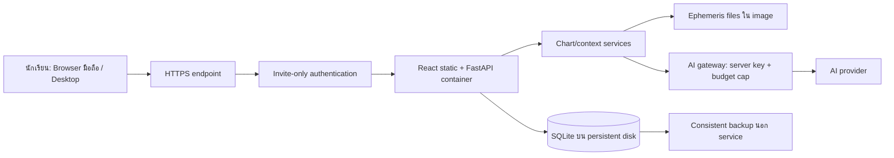

# Architecture สำหรับ Class Pilot และทางไป Mobile

ตรวจเอกสารผู้ให้บริการ: 13 กันยายน 2026 · เป็นข้อเสนอ ยังไม่ได้ provision, ซื้อบริการ หรือ deploy

## คำแนะนำหลัก

เริ่มด้วย responsive web และ backend เดิมใน **Docker service เดียวบน Render แบบมี persistent disk** สำหรับคลาสขนาดเล็กที่เชิญเข้ามาลอง ใช้โครง React build + FastAPI ที่ repo มีอยู่ ลดการย้าย framework/ฐานข้อมูลก่อนคลาสแรก จากนั้นแยก Postgres/worker เมื่อข้อมูลโหลดจริงบอกว่าจำเป็น

Render รองรับการ build Dockerfile จาก repo หรือใช้ prebuilt image ตาม [Docker documentation](https://render.com/docs/docker) และ [Web service documentation](https://render.com/docs/web-services) ข้อเสนอนี้เป็นการเลือกจากความเข้ากันได้กับโค้ด ไม่ได้อ้างว่า deploy สำเร็จหรือโหลดได้ตามจำนวนผู้เรียนโดยยังไม่ทดสอบ

ใช้บริการที่ไม่พักเครื่องระหว่างคลาสและพื้นที่เก็บข้อมูลถาวร แผน free ที่ข้อมูลเป็น ephemeral ไม่เหมาะกับ SQLite โปรไฟล์และประวัติ รายละเอียด disk ของ Render ระบุว่าใช้กับ paid service, mount ผูกได้หนึ่ง instance และ deploy มีช่วงหยุดบริการเมื่อใช้ disk จึงต้องวางเวลาปรับปรุงนอกคลาส ดู [Persistent disks](https://render.com/docs/disks)

## โครงระยะแรก

สมมติฐานการวางแผนคือคลาสเล็กระดับหลักสิบและยังไม่ต้อง high availability ไม่ใช่ load capacity ที่รับรองแล้ว ก่อนเชิญต้องจำลอง burst คำนวณพร้อมกันและ AI timeout ให้ผ่าน

### พื้นที่รับผิดชอบ

| ส่วน | แนวทาง pilot |
|---|---|
| Frontend | build แล้วให้ FastAPI serve origin เดียว ลดความซับซ้อน CORS; นำ design ที่ผ่าน review ไป integrate แยกงานจากต้นแบบ |
| Authentication | เชิญบัญชีผู้เรียนและ provision instructor นอก public registration; ใช้ session cookie HttpOnly/Secure พร้อม CSRF protection ตามรูปแบบ auth ที่เลือก |
| Calculation | แยก calculation service function ใช้ร่วมหน้าอ่านและ AI; cache ด้วย normalized inputs + engine/version; serialize ช่วงคำนวณที่ใช้ global Swiss settings หรือใช้ process isolation เพื่อกันค่าของคำขออื่นรบกวน |
| Context | เก็บ chart snapshot + evidence + context version; อย่าให้ frontend ส่ง JSON ดวงที่ server เชื่อทันที |
| Database | SQLite disk instance เดียวสำหรับ pilot, transactions, busy timeout/WAL ตามการทดสอบ; consistent SQLite backup ไม่ copy ไฟล์ขณะเขียนโดยไม่ใช้วิธีที่รองรับ |
| AI | server key เท่านั้น, quota ผู้เรียนเพื่อคุมงบทดลองโดยไม่มี paywall, input/output/thinking limit, หนึ่งคำขอพร้อมกันต่อบัญชี, budget รวมและ kill switch |
| History | server-side reports/threads ผูก account/profile/version และตรวจ ownership ทุกครั้ง |
| Operations | health endpoint, error logs ที่ไม่เก็บข้อมูลเกิด/คำถาม/keys, เวอร์ชัน release, restore procedure และ rollback |

การใช้ Cloudflare Access เป็นตัวเลือกเสริมถ้ามีโดเมน/บัญชีพร้อม: จำกัดผู้เรียนตาม identity จาก [Access applications](https://developers.cloudflare.com/cloudflare-one/access-controls/applications/http-apps/) แต่ต้องป้องกันการเข้าตรง origin และตรวจ access assertion ฝั่ง server; การครอบเฉพาะ custom domain แล้วปล่อย provider URL เข้าตรงได้ไม่ใช่ invite-only protection ไม่เพิ่มชั้นนี้เป็นเงื่อนไขจำเป็นถ้าต้องตั้งบัญชีใหม่หลายระบบในวันนี้

## สิ่งที่บล็อกการเปิดแอปจริงในสภาพปัจจุบัน

| ต้องแก้/ตัดออก | เหตุผล |
|---|---|
| public first-user/admin-email promotion | ผู้สมัครทั่วไปอาจได้สิทธิ์ผู้ดูแล; การจำกัดนักเรียนที่หน้าเว็บไม่แก้ role logic |
| JWT env mismatch และ known fallback | deployment ตั้งชื่อต่างจากที่ backend อ่าน ต้อง fail closed และ provision key ใหม่อย่างถูกต้อง |
| payment simulation และข้อความซื้อแพ็ก | pilot ไม่เก็บเงิน ลบ route simulation และใช้ class entitlement แยกจาก admin/pro |
| key persistence | key เข้ารหัสอยู่ backend/.secret_key แต่นอก data volume; เก็บ stable secret นอก image และซ้อม restore |
| missing dependencies / lock และ build contamination | auth import bcrypt/PyJWT ไม่ประกาศ, ไม่มี .dockerignore/.gitignore ใน root ที่ตรวจ, Docker COPY backend สามารถพาฐานข้อมูล/key เข้า image ต้อง sanitize ก่อน push/build |
| context incompleteness | AI route ไม่ใช้ enriched macro/transits และตัด Sun aspects ทิ้ง ต้องทำ shared verified context หรือปิด AI pilot ไว้ก่อน |
| incorrect unsupported readings | ปิด Bazi integration จนตรวจสูตร, ไม่เรียก birthday snapshot ว่า full-year forecast, ไม่แสดง age heuristic เป็น exact planetary return, กรณีไม่รองรับต้องระบุชัด |
| report/thread loss หรือผิดโปรไฟล์ | ก่อนให้ใช้ข้อมูลส่วนบุคคลต้องเก็บประวัติและผูก subject/version; คำขอเก่าห้ามทับคนใหม่ |
| unbounded public computation/AI | จำกัดสิทธิ์เข้าถึง, request size, rate/concurrency, retry และงบ provider รวมแม้ใช้ฟรี |

หลักฐานรายละเอียดอยู่ใน audit และรายงาน context reviewer รายการเหล่านี้ยังไม่ได้แก้ใน source โดยงานรอบนี้

### เรื่อง license ที่ต้องเลือกก่อนเปิดบริการ

Swiss Ephemeris ให้เลือก AGPL หรือ Professional License และเอกสาร license ระบุให้เลือกก่อนเผยแพร่/เปิด public service ตรวจเส้นทางที่ใช้อยู่กับเงื่อนไขจริง ไม่ถือว่าใช้ฟรีในคลาสแล้วไม่มีข้อกำหนด ดู [license ของผู้พัฒนา](https://github.com/aloistr/swisseph/blob/master/LICENSE) ยังไม่พบหลักฐานการเลือก license หรือสัญญาในสิ่งที่ตรวจ และต้องตรวจเงื่อนไข wrapper/data ที่นำขึ้นด้วย

## แผนปล่อยภายในวันนี้แบบมีเงื่อนไข

**ทางที่พร้อมตรวจได้ตอนนี้:** ต้นแบบ static สำหรับให้ผู้เรียนลอง flow/ภาษา/design ไม่รับข้อมูลเกิดจริง ไม่เรียก AI และไม่แสร้งเป็นเครื่องพยากรณ์ เหมาะกับ usability session ถ้า application blockers ยังไม่ผ่าน ไม่ใช้ต้นแบบนี้แทนผลคำนวณในบทเรียน

**ทางเปิด pilot ของแอปจริง:** ทำตามลำดับต่อไปนี้และเปิดเฉพาะส่วนที่ผ่านตรวจ ไม่มีการรับรองเส้นตายก่อนรู้ว่ามีบัญชีโฮสต์และ source ที่พร้อม deploy แล้ว

1. Freeze scope: personal Sun-first + บทชีวิต + ดูที่มา + บันทึก; ไม่มี payment และปิด Bazi/daily/company/relationship analysis ที่ยังไม่พร้อม
2. แก้ blockers ด้าน auth/secrets/context/history หรือกำหนด demonstration mode ที่ใช้เพียงข้อมูลตัวอย่างที่อนุญาตและไม่เปิด feature ที่ผิด
3. สร้าง clean private repository/image; workspace ปัจจุบันยังไม่ใช่ Git repo ไม่ upload ทั้งโฟลเดอร์ Dropbox ที่มีข้อมูลเกิด PDF/DB/secret อัตโนมัติ
4. Build จาก dependency ที่ประกาศครบ ใช้ Node version ตรง engine requirement ของ Vite ที่ติดตั้ง Python image ที่ทดสอบแล้ว เพิ่ม health endpoint และ bind PORT ตาม host
5. ตั้ง persistent data path, database URL และ stable secrets ผ่าน host configuration ไม่ใส่ secret ใน repository/image; provision instructor ก่อนเชิญ
6. Deploy staging, ตรวจ unauthenticated access และ ownership isolation แล้วทดสอบ profile, context, history, refresh, error/retry และ restart/restore
7. จำลองผู้เรียนพร้อมกันในขนาดคลาสจริง ตรวจ p95 latency, errors, CPU/memory และ budget; แสดง queue/สถานะเมื่อจำเป็น
8. เชิญกลุ่มเล็กก่อน เก็บ feedback กับ context evidence version, มีช่องช่วยเหลือและ kill switch ระหว่างคลาส

ข้อมูลที่จะต้องมีเมื่อเริ่ม deploy จริง: โฮสต์/บัญชีที่จะใช้, ขนาดคลาสและช่วงเวลา, บัญชี instructor/รายชื่อ invite, งบ AI ทดลอง, แนวทาง license และความยินยอมสำหรับข้อมูลที่ส่งให้ AI ในรอบนี้เป็นเพียงการแนะนำ architecture จึงยังไม่ส่งข้อมูลหรือซื้อบริการใด

## Go / No-go

- GO สำหรับ design usability session เมื่อ static prototype ผ่าน reviewer และไม่มีการสื่อว่าเป็นผลคำนวณจริง
- GO สำหรับ student application pilot เมื่อไม่มี public admin/known secret, ข้อมูลไม่ปะปนข้ามคน, context ตรง source, unsupported features ปิดจริงทั้ง UI/API, budget bounded และ clean deploy/restore ผ่าน
- NO-GO สำหรับบริการจริงถ้า route/secret/subject isolation ยังผิด แม้ build และ tests เดิมผ่าน
- UI design pass ไม่ใช่หลักฐานว่า engine/AI หรือ deployment ผ่าน

## Mobile ในอนาคต

เริ่ม responsive web เพื่อเข้าผ่านลิงก์ในคลาส ไม่รอ app-store review จากนั้นเพิ่ม installable PWA โดย cache เฉพาะ app shell และเนื้อหาที่ผู้ใช้เลือก ไม่ cache API/ข้อมูลเกิดโดยไม่ตั้งใจ

ถ้าต้องการ native distribution และความสามารถของอุปกรณ์ ประเมิน Capacitor เพื่อใช้ web UI เดิมร่วมกับ native runtime ซึ่งเอกสารระบุรองรับ web-focused cross-platform apps ดู [Capacitor documentation](https://capacitorjs.com/docs) ยังต้องทดสอบ auth/deep links/storage/permissions และกระบวนการส่ง store แยก ไม่ใช่ wrap แล้วพร้อมปล่อยทันที

เมื่อ mobile UX ต้องต่างจากเว็บมาก เช่น gesture, calendar, offline journal, ใช้ React Native/Expo เป็น client ใหม่ได้โดยใช้ API/context contracts เดิม การคำนวณและ AI key อยู่ server ร่วมกัน ไม่ฝัง API key ใน mobile app

## ขยายเมื่อ pilot พิสูจน์แล้ว

แยก frontend static hosting, stateless FastAPI, managed Postgres, object storage สำหรับ reports และ job worker สำหรับ event search/AI เมื่อมี load และความจำเป็นจริง เพิ่ม queue/cache อย่างเป็นระบบ ไม่เริ่มด้วย microservices/vector DB ทุกส่วน

Migration สำคัญ: replace SQLite-only auto-migration ด้วย schema migration ที่รองรับ Postgres, shared rate limiter หลาย instance, job idempotency และ transactional reservations, consent/deletion/backup retention, observability ที่แยก latency/cost/grounding errors

ระบบเติมเวลา Lightning ในอนาคตต่อที่ entitlement layer เดียวกันกับสิทธิ์คลาส โดยไม่เปลี่ยน calculation/context engine เป็นรอบงานถัดไปหลังทราบ usage และคุณค่าที่ผู้ใช้ได้รับ
