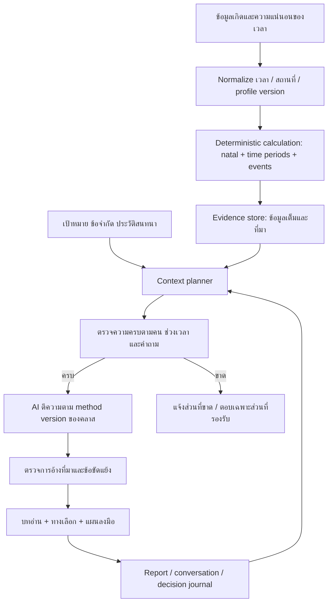

# ทิศทางผลิตภัณฑ์รอบใหม่: Sun-first planning

สถานะ: ข้อเสนอและต้นแบบสำหรับตรวจทาน ไม่ใช่ฟีเจอร์ production ที่ทำเสร็จแล้ว

## ข้อกำหนดล่าสุดที่ใช้แทนโจทย์เดิม

- พักการเก็บเงินไว้ก่อน: ไม่ทำ checkout, subscription หรือ Lightning ในรอบ pilot
- ใช้ข้อมูลคำนวณและบริบทต่อเนื่องเป็นความแตกต่างของ AI
- วิธีอ่านเน้นภาพใหญ่สู่เล็ก โดยอาทิตย์และมุมสู่อาทิตย์เป็นแกน ไม่ใช่แค่ daily Sun-sign horoscope
- ผู้ใช้ชอบวางแผนระยะยาว สนใจงาน การเงิน และการลงทุน ตั้งแต่ก้าวรายวันถึงกรอบชีวิต 108 ปี
- Bazi เป็นทางเลือกเสริมที่ต้องตรวจโดยผู้เชี่ยวชาญก่อน ไม่บังคับผสานทุกคำตอบ
- แยกคู่ครอง หุ้นส่วนธุรกิจ และบริษัทออกจากบทอ่านส่วนตัว
- CI ใหม่เป็น **modern tactile Material UI**: ลำดับสะอาด, พื้นผิวยกตัว, มุมมน และ interaction ที่สัมผัสได้; ภาพประกอบใช้สีวาดหนา/impasto และเทพในตำนาน โดยมี **พิเภกในบทผู้รู้ดูดาวและที่ปรึกษาของพระราม** เป็นแรงบันดาลใจหลัก ไม่มีสีดำ
- เริ่ม responsive web สำหรับคลาส Astrology for investment planning แล้วเก็บทางเลือก mobile app ไว้

รายงาน audit เดิมยังมีประโยชน์สำหรับข้อบกพร่องโค้ด แต่คำแนะนำราคาและ paywall ในนั้นเป็นงานอนาคต ไม่ใช่ scope ของ pilot นี้

## Product thesis

“แผนที่ชีวิตที่ตรวจที่มาได้ และช่วยเปลี่ยนภาพใหญ่เป็นก้าวที่ลงมือทำ”

ความต่างที่ควรลงทุนพัฒนา: คำนวณข้อเท็จจริงเอง → เลือกบริบทให้ตรงกับคน/ช่วงเวลา/คำถาม → ตีความตามวิธีของผู้สอน → บอกที่มาและข้อจำกัด → เก็บแผนและผลทบทวน ไม่ควรใช้เพียงคำว่า ‘AI ดูดวงละเอียด’ เป็นจุดขาย

ความแม่นยำมีสามเรื่องแยกกัน: (1) คำนวณตำแหน่งและเวลาได้ถูก (2) ตีความตรงตามกฎวิธีอ่านของคลาส (3) คำแนะนำช่วยให้ผู้ใช้วางแผนดีขึ้น ข้อแรกและข้อสองทดสอบได้โดยตรง ส่วนผลชีวิตหรือผลตอบแทนลงทุนไม่ใช่สิ่งที่ยืนยันจากการคำนวณดาวเพียงอย่างเดียว

## ชื่อเสนอ

| ชื่อ | บุคลิก / เหตุผล | สิ่งที่ต้องพิจารณา |
|---|---|---|
| **สุริยวิถี · Solar Atlas** | สุริยะ + เส้นทาง + แผนที่ระยะยาว เข้ากับแนวทาง Sun-first และภาพที่ปรึกษาดูดาว | ชื่อคู่ไทย/อังกฤษเป็นข้อเสนอด้านแบรนด์ ไม่ใช่คำแปลศัพท์เทคนิคที่อ้างอย่างเป็นทางการ |
| **Solarian Atlas** | รักษาความต่อเนื่องจากโปรเจกต์เดิม และเพิ่มภาพของเครื่องมือวางแผน | คำ Solarian ยังต้องอธิบายให้ผู้ใช้ไทยเข้าใจ |
| **Solar Thread · สายทางสุริยะ** | เชื่อมภาพชีวิตและบริบทสนทนาที่ไม่ขาด เหมาะกับสมุดแผน | ชื่ออังกฤษสื่อ AI context ทางอ้อม แต่สื่อเรื่อง 108 ปีน้อยกว่า Atlas |
| **Phiphek · พิเภก** | ผูกกับ brand story ของผู้ให้คำปรึกษาที่อ่านจังหวะฟ้า ใช้เหตุผล และช่วยพระรามวางแผน เหมาะกับบุคลิก celestial adviser มากกว่าผู้พยากรณ์ | เป็นเพียงชื่อทดลอง ต้องทดสอบความเข้าใจ น้ำเสียงทางวัฒนธรรม การเขียนไทย/อังกฤษ และความเหมาะสมกับผู้ใช้ก่อนเลือกจริง |
| **Phiphek Atlas** | รวมตัวละครนำทางกับภาพของเครื่องมือวางแผนระยะยาว ทำให้ชื่อบอกทั้งบุคลิกและหน้าที่ | ยาวกว่า `Phiphek` และอาจต้องมีคำโปรยอธิบายสำหรับคนที่ไม่รู้จักเรื่องรามเกียรติ์ |

ชื่อทั้งหมดรวม `Phiphek` ยังเป็น **provisional naming options** ไม่มีชื่อใดเป็นชื่อสุดท้าย แนะนำทดสอบ “สุริยวิถี”, “Solarian Atlas” และ “Phiphek” โดยให้นักเรียนอ่านชื่อและคำโปรยครั้งเดียว แล้วถามว่าเข้าใจว่าเครื่องมือช่วยอะไรและรู้สึกว่าบทบาทเป็น “ที่ปรึกษา” หรือ “ผู้ทำนาย” รายการนี้ไม่ได้ตรวจโดเมน เครื่องหมายการค้า หรือความพร้อมใช้เชิงพาณิชย์

คำโปรยเสนอ: **“มองชีวิตให้ไกล เลือกก้าวต่อไปให้ชัดขึ้น”**

## Brand correction: modern tactile mythical

ทิศทาง parchment/editorial line-art เดิมถูกแทนที่แล้ว ไม่ใช้ texture กระดาษ เส้นวาดบาง หรือองค์ประกอบแบบหน้าหนังสือเก่าเป็นภาษาหลักของ interface รอบต่อไป

ภาษาภาพใหม่มีสองชั้นที่ต้องแยกหน้าที่กัน:

1. **UI layer — modern tactile Material:** โครงสะอาด, spacing ชัด, surface ซ้อนระดับ, card มุมมน, ปุ่มและตัวเลือกมี pressed/selected state ที่รู้สึกตอบสนองได้ ใช้ elevation และขอบสีอ่อนเพื่อบอก hierarchy โดยไม่พึ่งสีดำ
2. **Illustration layer — painted mythical:** ใช้ภาพเทพ/ที่ปรึกษาและจักรวาลที่มี texture สีวาดหนาแบบ impasto, แสงทอง, jade, coral และ ivory เพื่อสร้างความทรงจำทางแบรนด์ ภาพไม่ทำหน้าที่เป็น chart หรือหลักฐานคำนวณ

เรื่องเล่าหลักได้แรงบันดาลใจจาก **พิเภกในฐานะ celestial adviser to Rama**: สังเกตสัญญาณ, เข้าใจภาพใหญ่, ให้คำปรึกษาด้วยเหตุผล แล้วช่วยเปลี่ยนความรู้เป็นแผน การสื่อสารต้องรักษาบทบาท “ผู้ให้ปัญญาและมุมมอง” ไม่ทำให้พิเภกกลายเป็นผู้รับประกันอนาคตหรือสัญญาณซื้อขาย

ภาพแนวคิดที่อนุมัติให้ใช้กำหนด mood คือ `design-preview/assets/phiphek-material.png`: พิเภกถือดวงอาทิตย์และอ่านแผนที่ฟ้า ท่ามกลางสถาปัตยกรรมลอยฟ้าและพื้นผิว impasto สี ivory/jade/gold/coral ภาพนี้เป็น generated concept asset ไม่ใช่หลักฐานทางประวัติศาสตร์หรือข้อสรุปเรื่องรูปแบบเครื่องแต่งกาย ก่อนใช้เผยแพร่กว้างควรตรวจความเหมาะสมทางวัฒนธรรมและสิทธิ์การใช้ asset ตาม workflow จริง

ข้อห้าม “ไม่มีสีดำ” ใช้กับ background, text, shadow, icon และ illustration treatment ของ CI นี้ เลือก deep jade หรือ warm umber ที่ผ่าน contrast แทน near-black และห้ามใช้ black overlay/black drop shadow แบบค่าเริ่มต้นของ component library

## User journey

ผู้ใช้ใหม่: หน้าประโยชน์ → ดูตัวอย่างที่ติดป้าย → กรอก/ยืนยันข้อมูลเกิด → อ่านภาพรวมอาทิตย์และบทชีวิต → เลือกงาน/เงิน/ลงทุน → เปลี่ยนช่วงเวลา → บันทึกหนึ่งก้าว → คุยต่อโดย context เดิม

ผู้ใช้กลับมา: เปิดสมุดแผน/สิ่งที่ติดค้าง → ทบทวนวันนี้ภายในแผนระยะยาว → ดูเหตุผลและหลักฐาน → บันทึกสิ่งที่ทำและข้อมูลที่ทำให้เปลี่ยนแผน ไม่ต้องอ่านรายงาน 108 ปีใหม่ทุกครั้ง

การแสดงผลเริ่มจากภาพใหญ่เพื่อสอนวิธีคิด แต่ต้องให้ผู้ใช้กลับเข้าสู่ช่วงเวลาที่เคยอ่านได้ทันที ความคิด macro-to-micro ไม่จำเป็นต้องบังคับคลิกผ่านทุกระดับทุกครั้ง

Navigation หลักสามส่วน: **แผนชีวิต / ผู้ร่วมทาง / สมุดแผน** ส่วนข้อมูลเชิงเทคนิคอยู่ใน “ดูที่มา” ไม่แยกเป็นโหมดหลายชื่อให้ผู้ใช้ใหม่เลือกก่อนเข้าใจประโยชน์

### ช่วงเวลาและความหมาย

| ระดับ | ผู้ใช้ควรได้อะไร | ข้อมูลที่ต้องมีจริง |
|---|---|---|
| 108 ปี | ภาพวงรอบและหัวข้อระยะยาว ไม่ใช่คำพยากรณ์ตายตัวทุกปี | natal + major/sub periods และขอบเขตเวลาที่สอดคล้อง |
| บทชีวิต | ประเด็นหลักของช่วงนี้กับวิธีจัดลำดับความสำคัญ | ช่วงเสวยอายุ/แทรกที่ถูกต้อง + solar core |
| ปี | เป้าหมายและหน้าต่างเวลาที่ต้องทบทวน | event search ครอบคลุมปี ไม่ใช่ดาวจรวันเกิดวันเดียว |
| 90 วัน / เดือน | แผนลงมือและหมุดหมายทบทวน | interval ที่ระบุ + event windows ที่เกี่ยวข้อง |
| วันนี้ | หนึ่งก้าวพร้อมบริบทจากภาพใหญ่ | วัน/เวลาท้องถิ่นจริง + transits รายวัน รวมดาวเร็วที่จำเป็น |

ต้นแบบมีตัวเลือก 108 ปี / บทชีวิต / ปี / 90 วัน / วันนี้; รายเดือนเป็นรายละเอียดที่เสนอเพิ่มภายหลัง ไม่ได้สร้าง daily engine ในรอบนี้ หน้า “วันนี้” ในต้นแบบระบุว่าเป็นแบบฝึกทบทวน ไม่ใช่คำอ่านดาวจรจริง

### เหตุผลที่คงตัวเลื่อน 108 ปีแบบทีละ 1 ปี

มุมมอง 108 ปีต้องมีทั้ง **global overview** และการสำรวจปีเฉพาะ เพราะผู้ใช้ต้องเห็นก่อนว่าปีหนึ่งอยู่ตรงไหนของเส้นทางชีวิต แล้วจึงอ่านรายละเอียดโดยไม่หลุดจากภาพใหญ่ ตัวเลื่อนช่วงอายุ 0–108 ปีจึงคงไว้และใช้ `step=1` เพื่อเปรียบเทียบปีติดกันได้ต่อเนื่อง ไม่กระโดดข้ามช่วงที่ผู้ใช้อยากทบทวน

ตัวเลื่อนไม่ควรเป็น control เดียว โดยเฉพาะบนมือถือและสำหรับผู้ใช้ที่ต้องการความแม่นยำ จึงต้องมีสามวิธีที่สะท้อน selected age เดียวกัน: slider สำหรับสำรวจภาพรวม, ปุ่ม **ปีก่อน / ปีถัดไป** สำหรับเดินทีละปี และช่องกรอกอายุสำหรับไปยังปีที่ต้องการโดยตรง บนจอเล็กให้เห็นอายุที่เลือก ปุ่มก่อน/ถัดไป และช่องกรอกโดยไม่เกิด horizontal overflow; ที่อายุ 0 และ 108 ให้ปิดปุ่มที่เดินต่อไม่ได้

ในระบบจริง selected age ต้องผูกกับ profile และแปลงเป็นปีปฏิทิน/ช่วงวันที่จากวันเกิดที่ยืนยันแล้ว พร้อมบอกกติกาเรื่องอายุเต็มหรืออายุย่างอย่างชัดเจน ค่าอายุอยู่ใน URL/workspace state เพื่อกลับมาอ่านจุดเดิมได้ แต่การเลือกปีไม่ทำให้ข้อความตัวอย่างกลายเป็นผลคำนวณจนกว่า engine จะส่งดาวเสวยอายุ ดาวแทรก และมุมสัมพันธ์สู่อาทิตย์ของปีนั้นจริง

ข้อกำหนด accessibility คือ native labelled range พร้อม `aria-valuetext`, ใช้ปุ่มลูกศรบน keyboard ได้, control ทุกตัวมี target อย่างน้อย 44px และมีผลลัพธ์ข้อความที่ประกาศอายุใหม่แก่ assistive technology โดยยังคง global overview ไว้เหนือรายละเอียดปี

## โครงบทวิเคราะห์ที่ใช้งานได้

ทุกบทอ่านควรมี:

1. **ภาพใหญ่:** ช่วงชีวิตใดครอบคำถามนี้ และประเด็นหลักคืออะไร
2. **แกนอาทิตย์:** ตำแหน่ง/มุมที่ใช้ เหตุผลที่ให้ความสำคัญ และข้อมูลอื่นที่ทำให้ต้องปรับการตีความ
3. **เชื่อมกับคำถาม:** อธิบายให้ตรงเรื่อง ไม่ใช้ข้อความเดียวกับทุกคน
4. **ทางเลือก:** อย่างน้อยสองทาง พร้อมเงื่อนไขว่าทางใดเหมาะเมื่อใด
5. **ก้าวที่ทำได้:** งานเล็กที่วัดหรือทบทวนได้ พร้อมข้อมูลจริงที่ยังต้องหา
6. **ที่มาและข้อจำกัด:** แยกผลคำนวณ กฎการตีความ ข้อมูลที่ผู้ใช้เล่า และข้อเสนอของ AI

ตัวอย่างหัวข้อที่ดีสำหรับการงาน: “บทบาทแบบไหนที่อยากพัฒนา และจะทดลองผ่านงานชิ้นไหน” สำหรับการเงิน: “เป้าหมายนี้มีเงื่อนไขและข้อมูลอะไรยังไม่ครบ” สำหรับการลงทุน: “สมมติฐานอะไรสนับสนุนมุมมองนี้ และอะไรจะทำให้ทบทวน” โดยใช้ข้อมูลธุรกิจ ราคา และความเสี่ยงจริงประกอบ ไม่แปลง aspect เป็น buy/sell signal หรือเปอร์เซ็นต์ผลตอบแทน

ตัวอย่างเหล่านี้เป็น output format ไม่ใช่บทวิเคราะห์ส่วนบุคคลที่อ้างว่าเกิดจากดวงใคร

## Context architecture

เก็บข้อมูลเต็มไว้เสมอ แต่ไม่จำเป็นต้องยัดทุกปีและทุกบทสนทนาเข้าคำขอเดียว ส่วนที่ต้องมีทุกครั้งคือ subject/version, คำถาม, ช่วงเวลาที่กำลังอ่าน, บริบทภาพใหญ่, Sun dossier, ข้อจำกัดข้อมูล และ conversation ล่าสุดที่เกี่ยวข้อง

Sun dossier ต้องไม่ถูกตัดเพราะแพ้มุมของดาวอื่นใน top-four ranking เก็บมุมสู่อาทิตย์ทุกคู่ที่เข้าเกณฑ์ตาม method ที่ version ไว้ พร้อมองศา/orb/applying-separating ที่ตรวจได้ แล้วค่อยเลือกข้อมูลรองตามคำถาม หาก input เกิน budget ให้ย่อคำบรรยายหรือดึงเพิ่มเป็นส่วน ไม่ทิ้งหลักฐานหลักเงียบ ๆ

ใช้ structured retrieval จาก profile/time/aspect IDs ก่อน vector search เพราะตำแหน่งดาวและช่วงเวลาเป็นข้อมูลเชิงโครงสร้าง หากเพิ่มคลังเอกสารคำสอนของคลาสจึงใช้ค้นข้อความแยก พร้อมระบุเวอร์ชันและแหล่งอ้างอิง ไม่ให้ข้อมูลจากผู้ใช้เขียนทับค่าคำนวณโดยไม่มีการแก้โปรไฟล์อย่างชัดเจน

รายละเอียด schema, edge cases และ eval suite อยู่ใน [รายงานตรวจบริบทและบทวิเคราะห์](reviews/analysis-context-v2.md)

## Bazi และผู้ร่วมทาง

Bazi เริ่มแบบ opt-in experimental: แสดงผลคำนวณและวิธีแปลความแยกจากแกนอาทิตย์ มีแหล่งที่มา ถ้าสองระบบให้มุมมองต่างกันต้องอธิบาย ไม่เฉลี่ยเป็นคะแนนความมั่นใจ เมื่อยังมีปัญหาสูตรเวลา/เสาวัน/อายุใน implementation ให้ปิดการผสาน AI ไว้ก่อน

| ส่วน | Input และ output ที่ควรแยก |
|---|---|
| คู่ครอง | โปรไฟล์สองคนที่ยินยอม + ความต้องการ/การสื่อสาร/เป้าหมายร่วม ไม่ตัดสินว่าเป็นคู่แท้จากคะแนนเดียว |
| หุ้นส่วนธุรกิจ | คนสองคน + บทบาท/อำนาจตัดสินใจ/ข้อตกลง/การรับความเสี่ยง ไม่ใช้ template ความรัก |
| บริษัท | องค์กร + เหตุการณ์ตั้งต้นที่เลือกพร้อมเหตุผลและหลักฐาน เช่น จดทะเบียน/เปิดกิจการ; ไม่สมมติเวลา และไม่ใช้ดวงแทน valuation |
| คนกับบริษัท | โปรไฟล์บุคคล + corporate event chart แยกเป็นอีก analysis mode ไม่สลับ subject เงียบ ๆ |

ปัจจุบัน source มีเพียง relationship label ไม่ได้คำนวณ synastry หรือดวงองค์กรจริง ต้นแบบจึงแยกหน้าและคำถามเตรียมข้อมูล แต่ยังไม่อ้างว่าทำ analysis เหล่านี้ได้

## ขอบเขตต้นแบบที่ส่งมอบ

ไฟล์ `design-preview/index.html`, `style.css`, `app.js` ใช้ฟอนต์ไทยในเครื่อง ไม่มี paid API หรือ third-party script โครง journey และ interaction ของต้นแบบยังใช้เป็นหลักฐานได้ แต่ parchment line-art styling เป็นงานเดิมที่ถูกแทนที่ ต้อง reskin เป็น modern tactile Material UI ตาม [CI proposal ล่าสุด](../design-system/solarian/CI_MODERN_MYTHICAL_PROPOSAL.md)

ภาพ `design-preview/assets/phiphek-material.png` เป็น visual reference หลักของรอบ reskin; ต้อง art-direct crop ตาม breakpoint, ใส่ขนาดภาพเพื่อกัน layout shift และเขียน alt text ตามบริบทที่ใช้

กดได้จริง: navigation, ช่วงเวลาและหัวข้อ, เปิดข้อมูลประกอบ, แบบฟอร์มจำลองที่ไม่บันทึกข้อมูลเกิด, ตัวเลือกไม่ทราบเวลา, คำถามเตรียมข้อมูลคู่ครอง/หุ้นส่วน/บริษัท, Bazi explanation, บันทึกแผน/ร่างคำถามลง local browser และทำเครื่องหมายทบทวนแล้ว

ยังไม่ทำ: คำนวณดวงจากแบบฟอร์ม, live AI, authenticated storage, sync ข้ามอุปกรณ์, daily transit analysis, relationship/company engine, payment และ deployment ออนไลน์

คะแนน design ใช้รับรองต้นแบบในขอบเขตนี้เท่านั้น ไม่แทนการตรวจความถูกต้อง engine หรือ production readiness ดู [ผลตรวจ design](reviews/design-v2.md) และ [ผลตรวจ journey](reviews/journey-v2.md)

## แผนสำหรับคลาสแรก

ให้ผู้เรียนทำภารกิจสั้นสามข้อ: หาตำแหน่งข้อมูลอาทิตย์และที่มา, เปลี่ยนช่วงเวลาโดยบอกความสัมพันธ์กับภาพใหญ่ได้, และบันทึกหนึ่งสิ่งที่จะทบทวน ถามต่อว่าข้อความไหนมีประโยชน์/กว้างเกินไป/ขาดหลักฐาน

เก็บผลการใช้งานและความเข้าใจ ไม่ใช้คะแนนความพึงพอใจแทนความถูกต้องดาราศาสตร์ และไม่ใช้ความรู้สึกว่าทำนายตรงเป็นหลักฐานผลตอบแทนการลงทุน

แนวทาง online วันนี้และทางเลือก mobile อยู่ใน [แผน architecture สำหรับ class pilot](CLASS-PILOT-ARCHITECTURE.md)
